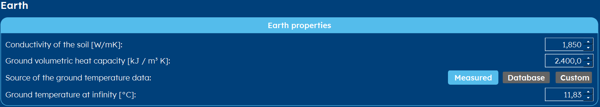

.. _TRT:

How do you input a TRT?
#######################
In this short article, you will learn what a TRT-test is and how you can input its data into GHEtool.

What is a TRT-test?
===================
TRT stands for *Thermal Response Test*. It is an in-situ test to measure the ground thermal properties at a specific location.
Since all the tabulated ground data is an oversimplification of reality and ground properties play an important role in the final
design of the borefield, it is recommended to use TRT for big projects.

.. note::
    Practically, a TRT-test takes place after the first borehole has been drilled, in the same way

How to enter this into GHEtool?
===============================
Since a TRT measures 1) the ground temperature at infinity (i.e. the undisturbed ground temperature), 2) ground thermal conductivity and 3) the borehole thermal resistance,
we have to enter all those parameters in GHEtool.

Ground properties
-----------------
For the ground properties, you go to the :ref:`tab earth` tab and you select *Measured* as the source for the
ground temperature data. The ground thermal conductivity you can enter straight away.

In the example below, the TRT measured a thermal conductivity of 1.85W/mK and an undisturbed ground temperature of 11.83°C.

Borehole thermal resistance
---------------------------
To set the value of the borehole thermal resistance, you go to the :ref:`tab options` tab and select *constant*
for the borehole resistance. Next, you go to the :ref:`tab thermal resistance` tab and you enter the value
from the TRT.

.. warning::
    Using TRT-data for the aim of determining the required depth is dangerous, since the measured borehole equivalent thermal resistance
    is only valid for one specific depth (since this parameter is a function of the depth). Since this aim changes the depth of the boreholes
    the borehole resistance will change as well. This effect can be very significant if you have a fluid regime on the border of laminar/turbulent flow
    (see also :ref:`reynolds number`).

    Please use this only as a first estimate and for final depths that are in line with the depth of the measured borehole.
