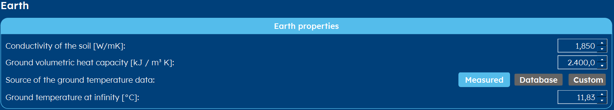

.. _TRT:

How do you input a TRT?
#######################
In this short article, you will learn what a TRT-test is and how you can input its data into GHEtool.

What is a TRT-test?
===================
TRT stands for *Thermal Response Test*. It is an in-situ test to measure the ground thermal properties at a specific location.

How to enter this into GHEtool?
===============================
Since a TRT measures 1) the ground temperature at infinity (i.e. the undisturbed ground temperature), 2) ground thermal conductivity and 3) the borehole thermal resistance,
we have to enter all those parameters in GHEtool.

Ground properties
-----------------
For the ground properties, you go to the *earth* tab (:ref:`tab earth`) and you select *Measured* as the source for the
ground temperature data. The ground thermal conductivity you can enter straight away.

In the example below, the TRT measured a thermal conductivity of 1.85W/mK and an undisturbed ground temperature of 11.83°C.

Borehole thermal resistance
---------------------------
To set the value of the borehole thermal resistance, you go to the *options* tab (:ref:`tab options`) and select *constant*
for the borehole resistance. Next, you go to the *Thermal resistance* tab (:ref:`tab thermal resistance`) and you enter the value
from the TRT.