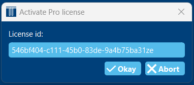

.. _activate license:

Activate a professional license
###############################
If you bought a professional license from `https://ghetool.eu <https://ghetool.eu/download/#license>`_ you can find your license on the invoice you received.
With this license, you can activate GHEtool Pro on **one machine**. This is important, since if you would like to switch the license to another PC, you first have to :ref:`deactivate license`.

To activate the GHEtool Pro license, go to *Settings* and select *Activate Pro license*

.. note::
    Please make sure you are connected to the internet when you try to activate a license.

Next, you enter the license in the input box and press *Okay*.

.. note::
    You can validate that your license has been activated if your company name is in the top bar of the program window.
    Also, the calculation and report buttons should be enabled.

.. warning::
    If you get the warning that the 'license validation has failed', this is mostly due to the fact that the license has already
    been activated on another machine. Since each license can be only activated a certain amount of times, you need to :ref:`deactivate license` on the other machine.

.. _deactivate license:

Deactivate the license
**********************
In order to deactivate the license, one has to go to *Settings* and select *Deactivate Pro license*.

