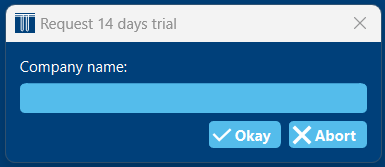

Activate a trial license
########################

Every installation of GHEtool Pro comes with an included 14-days free trial period.
To activate it, you select *Request 14 days trial* in the top bar, or you go to *Settings* to select the trial period.

.. note::
    If you don't see the option to activate a trial license, it is possible that the trial license is already active (you can check this
    by seeing if the title bar has 'trial' in it) or that it has already been activated.

Afterwards, you will be asked to set the name of the trial license. This is not that important, but it will be shown on the reports you create
during the trial period.

.. warning::
    Please make sure you are connected to the internet while requesting a trial license.
    If you are offline, chances are that you lose a trial license. If this is the case,
    please contact us at `info@ghetool.eu <mailto:info@ghetool.eu>`_.

Buy a professional license
**************************
After 14-days your trial period will end and you will have to get a professional, paid license from `https://ghetool.eu <https://ghetool.eu/download/#license>`_.
Afterwards, you need to activate it within GHEtool. Click here to see how: `activate license`_.