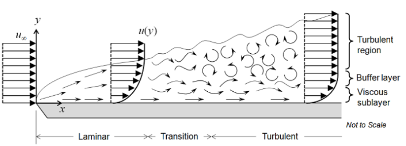
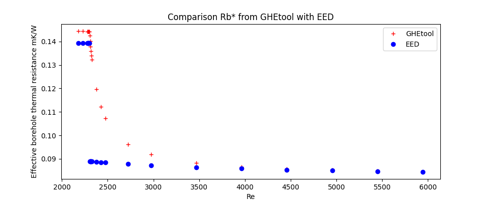

.. _eed comparison:

Why is my GHEtool-calculation different from a EED-calculation?
###############################################################
Earth Energy Designer (or EED in short) is the first and most used geothermal sizing software in Europe, so it can happen
that your competitor or client is working with this software instead of GHEtool. Although the features of EED differ (quite a lot)
from those of GHEtool (see also `are FAQ <https://ghetool.eu/faq/>`_), it is possible to convert an EED
project to a GHEtool project. The results you get in GHEtool, however, can differ sometimes from the results you get when working with EED.
This is due to the fact that GHEtool uses other, newer, models as implemented in `Pygfunction <https://github.com/MassimoCimmino/pygfunction>`_ [1]_
that can cause some difference in results.

In this FAQ, two major difference will be touched upon: a difference in fluid regime and a difference in buried depth.
This will be done based on an :download:`example EED <Figures/EED_example.txt>` and an :download:`example GHEtool <Figures/GHEtool_example.GHEtool>` document.

Fluid regime
============
As also explained in the FAQ: :ref:`reynolds number`, the reynolds number plays an important role in the effective borehole
thermal resistance, since it tells you something about the flow regime being either laminar or turbulent, with turbulent flow
leading to a low borehole thermal resistance, where a laminar flow leads to a high borehole thermal resistance. The cut-off between
laminar and turbulent flow, however, is not that clear, as shown in the image below (`source <https://www.comsol.de/blogs/which-turbulence-model-should-choose-cfd-application/>`_).

As one can see, there is no clear cut between laminar and turbulent flow, but there is a transition layer, especially, when
working with smooth pipes as is often the case in geothermal borefields. EED makes abstraction of the transition layer and goes
directly from a laminar to a turbulent at Re=2300, causing a sudden drop in the borehole thermal resistance.

Within GHEtool, we use the model validated by Gnielinski (2013), of a laminar flow when Re<2300 and a turbulent flow for
Re>4000 for the heat transfer calculations. Everything in between those two values gets interpolated in order to avoid
sudden, unphysical, drops in thermal resistance [2]_. This drop can clearly be seen in the figure below.

As you can see, when Re>4000, both EED and GHEtool give the same result, although they differ a lot in the transition region.
It is our believe that a smooth transition between the laminar and turbulent regime is the most physical. Note also
that EED and GHEtool use different heat transfer models for the laminar regime also.

This difference in the way the borehole thermal resistance is handled, can explain one of the difference in the example documents from above.
Here you see that the borehole thermal resistance in EED is 0,07675mK/W (line 99 in the document) whereas GHEtool gives 0,0988mK/W. Note that the Reynolds number is 2405,
so it falls right at the beginning of the transition layer. The minimum temperature over 50 years is, according to EED (line 138) -1.5°C,
where GHEtool tells you it is -2.01°C. This difference is the result of a bigger, but more accurate, borehole thermal resistance in GHEtool

If you enter the 0,07675mK/W as a constant borehole thermal resistance in GHEtool (see also scenario 'Manual thermal resistance')
in the example document, you get a minimum fluid temperature of -1.22°C in GHEtool, which is more optimistic than EED.
This can be explained by the next difference in underlying models.

Buried depth
============
In the :ref:`tab borefield` tab you need to tell GHEtool what the buried depth of the boreholes is. In GHEtool we assume
that heat transfer can occur from the ground to the environmental air and therefore this buried depth is needed. The higher this
value, the more 'insulated' the borefield becomes, since there is less heat transfer to the environment [3]_.

In EED, this buried depth is not an input, since their models assume the earth surface is insulated, meaning that no
heat transfer is taken into account between the borefield and the environmental air.

These two different approaches can cause a difference in the final result especially when there is a larger imbalance and a long simulation period.
The difference between the -1.22°C degrees in the second scenario of the :download:`GHEtool example <Figures/GHEtool_example.GHEtool>` and
the -1.5°C of the :download:`EED example <Figures/EED_example.txt>`, can be explained by this buried depth. GHEtool takes into account
that over a simulation of 50 years, there is some heat transfer of the surrounding air to the ground, dampening the imbalance effect.

If you increase this buried depth to e.g. 10m, you model the borefield like it is insulated from the environment, mimicing the
method within EED. This is done in the third scenario ('Manual resistance & buried depth') in the GHEtool example, and as you can see,
the minimum temperature is now -1.49°C, the same as in EED.

Final thoughts
==============
Modelling a geothermal borefield is an extremely difficult task where a lot of assumptions need to be made along the way.
Saying that one model is right and the other is wrong, is hence hard to do.

With GHEtool (Pro), we want to use the power of open-source models to stay up-to-date with the newest mathematical models
that are available, in order to give you, what we believe are, the most accurate simulation results.

.. rubric:: References
.. [1] Cimmino, M., Cook, J. C. (2022). pygfunction 2.2 : New Features and Improvements in Accuracy and Computational Efficiency [Conference paper]. Research Conference Proceedings, IGSHPA Conference 2022, 45–52. https://doi.org/10.22488/okstate.22.000015
.. [2] Gnielinski, V. (2013). On heat transfer in tubes. International Journal of Heat and Mass Transfer, 63, 134–140. https://doi.org/10.1016/j.ijheatmasstransfer.2013.04.015
.. [3] Cimmino, M., Bernier, M. (2014). A semi-analytical method to generate g-functions for geothermal bore fields, International Journal of Heat and Mass Transfer, Volume 70, Pages 641-650, ISSN 0017-9310, https://doi.org/10.1016/j.ijheatmasstransfer.2013.11.037.