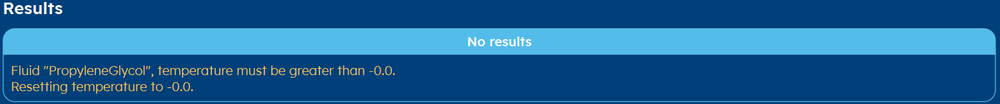

.. _errors:
Errors
######
Like every software program, you can create errors when working with GHEtool.
Most often, they occur on the result page. In this article, the most common errors are explained and it is
shown how they can be solved.

Gradient error
==============
.. image:: Figures/error_temp_gradient.png
  :alt: Error related to the aim required depth and the existence of a gradient

This error does occur rather often when working with the aim for calculating the required depth of a borefield, with a non-constant
ground temperature. If the load has a rather high cooling peak (and a rather low maximum average fluid temperature limit),
it is often the case that the fluid temperature is higher than the allowed limit. The algorithm hence tries to increase the depth,
but since a temperature gradient is present, this does increase the ground temperature, making the problem worse.

It is hence possible that there is no mathematical solution in this case.

.. hint::
    You can try to increase the number of boreholes in this case or increase the allowed maximum average fluid temperature
    to see if you can spot the problem.

Iterations error
================
.. image:: Figures/error_max_iterations.png
  :alt: Error that the maximum number of iterations is reached

Most methods within GHEtool are iterative and depending on the specific aim or the specific parameters, the number of iterations
can range from 2 to 20 easily. When this error occurs, it can mean that in order for the algorithm to find a solution,
more iterations are needed.

If you allow advanced settings in the :ref:`tab settings` tab and go the the tab :ref:`tab options` to increase the number
of iterations, this problem can most of the times be solved.

.. _duplicate:
Duplicate error
===============
.. image:: Figures/error_duplicate.png
  :alt: Error when two boreholes do overlap.

If you work with a custom borefield, this error can occur when two boreholes overlap. Please check your coordinates of the boreholes
on the :ref:`tab borefield` tab.

Columns error
=============
.. image:: Figures/error_different_columns.png
  :alt: Error when the wrong column names are selected
This error occurs when working with hourly data in a csv format in the :ref:`tab thermal demand` tab, when you selected
the wrong separator for the csv file or when you select the same column for both the heating and cooling load.
If you go to the :ref:`tab thermal demand` tab, you can correct this.

Decimal error
=============
.. image:: Figures/error_dec_point.png
  :alt: Error when the wrong decimal sign is selected

This error occurs when working with hourly data in a csv format in the :ref:`tab thermal demand` tab,
if you selected the wrong sign for the decimal point indicator.
If you go to the :ref:`tab thermal demand` tab, you can correct this.

Fluid error
===========

This error does occur when you work with a water-glycol mixture with a reference temperature that is below the freezing
temperature of the mixture. To solve this issue, please go to the :ref:`tab thermal resistance` tab and select either a higher
percentage of glycol or make the reference temperature higher.

.. note::
    Note that this reference temperature has an influence on the fluid properties like the dynamic viscosity, which influences
    the :ref:`reynolds number` and hence also the thermal resistance.

Runtime error
=============

Every method in GHEtool takes some time, since they require (a lot of) iterations. In the :ref:`tab settings` tab
a maximum runtime can be set, so the program cannot freeze for too long a time. If a method, for some reason, takes very long
to run, this error can occur.

.. note::
    Normally, this error does not occur, since all the methods are tested so they run rather fast.
    If, for some reason, this error does occur with a reasonable maximum run time (like a minute), please do contact
    the developers via `info@ghetool.eu <mailto:info@ghetool.>`_.
