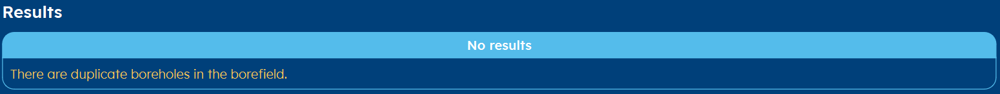

.. _errors:
Errors
######
Like every software program, you can create errors when working with GHEtool.
Most often, they occur on the result page. In this article, the most common errors are explained and it is
shown how they can be solved.

Gradient error
==============

Iterations error
================

.. _duplicate:
Duplicate error
===============

If you work with a custom borefield, this error can occur when two boreholes overlap. Please check your coordinates of the boreholes
on the :ref:`tab borefield` tab.

Columns error
=============

Same column name or wrong separator

Decimal error
=============

Runtime error
=============
.. image:: Figures/runtime_error.png
  :alt: Error when the method takes longer than the maximum allowed time.

Every method in GHEtool takes some time, since they require (a lot of) iterations. In the :ref:`tab settings` tab
a maximum runtime can be set, so the program cannot freeze for too long a time. If a method, for some reason, takes very long
to run, this error can occur.

.. note::
    Normally, this error does not occur, since all the methods are tested so they run rather fast.
    If, for some reason, this error does occur with a reasonable maximum run time (like a minute), please do contact
    the developers via `info@ghetool.eu <mailto:info@ghetool.>`_.
