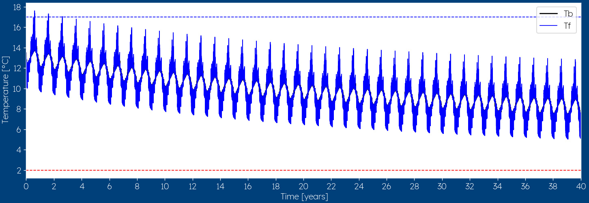

.. _interpret results::

How to interpret temperature profiles?
######################################

At the very center of a good borefield design, is the temperature plot with all the fluid temperatures. This plot
tells you everything you need to know about your design, but it also has some limitations. In this article, the interpretation
behind those temperature plots will be explained (:ref:`interpretation plots`) and also some of the effects that are not included
are discussed (:ref:`not included`).

.. admonition:: Tailored geothermal advice

    Software is designed for general cases, and special projects will always require customized advice or a tailored study.
    If you find yourself questioning whether the complexity of a particular project exceeds the current capabilities of the software,
    feel free to reach out to us at `wouter@ghetool.eu <mailto:wouter@ghetool.eu>`_ for a specialised method or consultancy advice.
    We can provide tailored guidance and assistance to address any challenges you may encounter, along with general training in borefield design.

.. _interpretation plots::

Interpretation of temperature profiles
**************************************

Temperature profiles exist in two different forms within GHEtool: :ref:`monthly profile` and :ref:`hourly profile`.

.. _monthly profile::

Monthly temperature profile
---------------------------
In this section, we will discuss some of the insights you can get from looking and studying a monthly based temperature profile.

.. image:: Figures/results.png
  :alt: Monthly temperature profile

When looking at the figure above, you can see that we have 7 different lines on the temperature plot.
The two dotted lines are respectively the maximum and minimum allowed average fluid temperature in the geothermal system.
This parameter you can set in the :ref:`tab earth` tab. The other curves are:

* **Tb** This is the temperature of the borehole wall, i.e. the ground close to the borefield.

.. note::
    The fluid temperatures you see within GHEtool are the *average fluid temperature* of the borefield.
    This is the average between the inlet and outlet temperature of the borefield.. If you want to know the maximum/minimum inlet or outlet
    temperature, you can calculate it yourself if you take into account the required :math:`\Delta T` across the borefield.

Next, there are two temperatures related to the peak loads: i.e. the maximum amount of power in both heating and cooling.
These high peaks lead to the most extreme fluid temperatures and are hence the most crucial in borefield design.

* **Tf peak cooling** This is the average fluid temperature you get during the peak in cooling.
* **Tf peak heating** This is the average fluid temperature you get during the peak in heating.

The last two temperatures are related to the base load (i.e. the average load in a certain month). The peak only occurs for
a couple of hours (which can be set in the :ref:`tab earth` tab), but the average load occurs for a whole month constantly.
This line is the average *average* fluid temperature you get when you assume the whole heating or cooling demand of a certain month,
is spread out evenly throughout this month and can be seen as the average fluid temperature you get on average during that month.

.. hint::
    If you have for example a heating demand of 730kWh, this will give you a base load of 1kW for the entire month.
    This 1kW is used to calculate the dotted red temperature curve.

* **Tf base cooling** This is the average monthly average fluid temperature in cooling.
* **Tf base heating** This is the average monthly average fluid temperature in heating.

.. _hourly profile::

Hourly temperature profile
--------------------------
When you have an hourly temperature profile, you see lesser lines on the temperature plot.
Where the :ref:`monthly profile` had to take into account that each month has potentially both heating and cooling,
an hourly profile has only one of the two.

.. note::
    Strictly speaking, even on an hourly basis, there could be a switch between heat injection and extraction within one hour.
    This would however require temperature simulations with a smaller-than-hourly load resolution, which is
    overkill for a geothermal design process.

The two dotted lines are respectively the maximum and minimum allowed average fluid temperature in the geothermal system.
This parameter you can set in the :ref:`tab earth` tab. The other curves are:

* **Tb: borehole wall temperature** This is the temperature of the borehole wall, i.e. the ground close to the borefield.
* **Tf: average fluid temperature** This is the average fluid temperature for every hour in the simulation period.

.. _not included::

What is not included?
*********************

While GHEtool demands numerous parameters across its various tabs to generate a single result, it is essential to note that
certain factors are not considered and merit special attention. The design of a geothermal system, particularly for large projects,
poses an intriguing challenge that necessitates extensive knowledge, complemented by valuable tools such as GHEtool Pro.

Thermal interference
--------------------
The influence of geothermal borefields extends beyond the borders of the borefield, affecting every geothermal system in their vicinity.
This influence can lead, for example, to lower-than-expected ground temperatures at your location, necessitating adjustments to the design criteria.

When undertaking a project in proximity to an existing borefield, it is crucial to carefully consider this influence during the system design.
One approach is to increase, for instance, the minimum allowed average fluid temperature to introduce an additional layer of safety.
For a more robust design, a specific thermal interference study is necessary.

.. image:: Figures/Interference.png
  :alt: Geothermal interference
  :width: 300
  :align: center

Dynamic behaviour
-----------------
All the ground models within GHEtool are what is called 'static.' This means that it neglects the thermal inertia inside the fluid and the borehole grout.
Every kilowatt (kW) of power you obtain outside the borefield is drawn instantaneously from the ground.

This assumption can be seen as an intrinsic safety feature when designing geothermal systems, as the average fluid temperatures
you obtain are most likely better than they will be in reality when there is thermal inertia.
If you want to reduce the investment cost of a borefield, it can be a solution to request a study on the dynamic behavior of the geothermal system.

Varying SCOP/SEER
-----------------
GHEtool operates under the assumption that the geothermal demand (refer to the :ref:`tab thermal demand` tab) remains
constant every year. This also implies that the Seasonal Coefficient of Performance (SCOP) and Seasonal Energy Efficiency Ratio (SEER)
are identical for both the first and last years. However, in the case of a system with a significant imbalance, this assumption is highly conservative.

For instance, consider a scenario where there is a persistent imbalance that progressively cools down the ground each year.
In practice, as the ground temperature decreases, the SCOP will also decrease, resulting in less heat being extracted from the soil.
This counteracts the initial imbalance, compensating for its effects.

Moreover, with a lower ground temperature, the SEER will likely increase due to the improved heat transfer during cooling.
Additionally, the cooling capacity increases, making it improbable for the thermal demand to remain constant throughout the years.

.. rubric:: References
.. [1] Lee, Seung-Min & Park, Seunghoon & Jang, Yong-Sung & Kim, Eui-Jong. (2021). Proposition of Design Capacity of Borehole Heat Exchangers for Use in the Schematic-Design Stage. Energies. 14. 822. 10.3390/en14040822.
