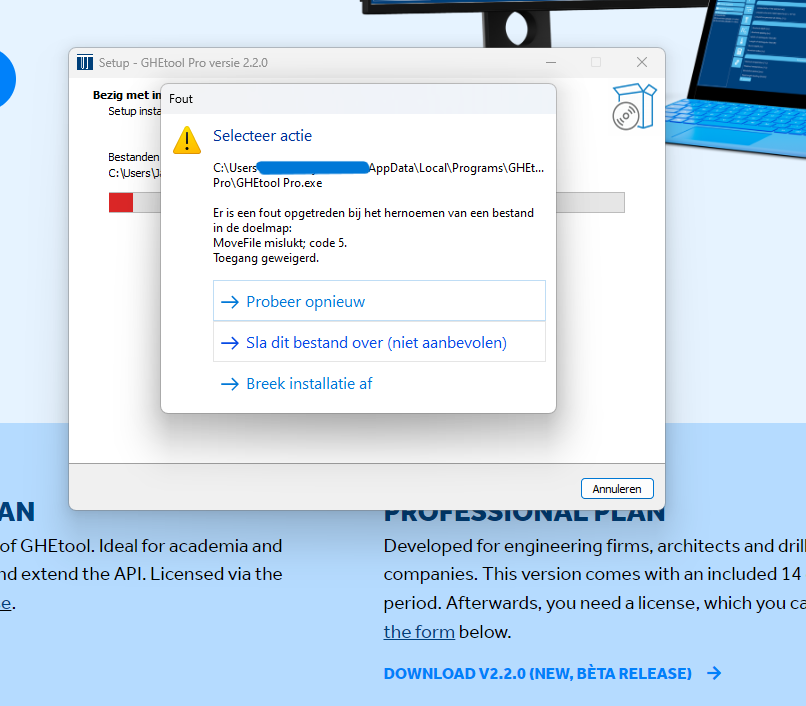

MoveFile Code 5 - error
#######################

Some users get a permission error when they try to install GHEtool.
Since GHEtool uses some resource on your PC to work properly, you need to have the rights on your PC to access them.
Mostly, this error occurs on machines that are centrally managed or where the user itself has not the administrator rights to the system.
To solve this error, try installing GHEtool as an administrator or ask your system administrator.

