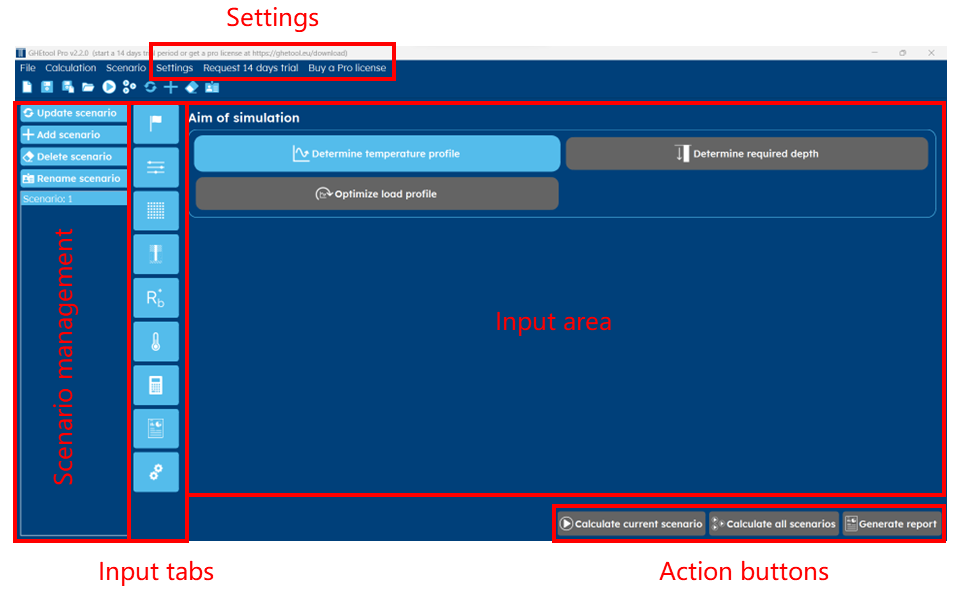

Get to know the GHEtool Pro interface
#####################################

This article shows you the general structure of the GHEtool Pro interface.
The figure below shows a schematic overview of the different features and buttons of the tool.
Below the figure, we will go into depth about what you can find here.

Aim
***

Option
******

Ground
******

Borefield
*********
