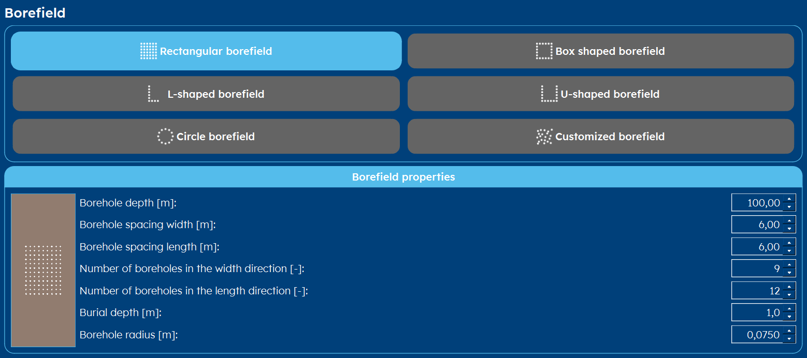
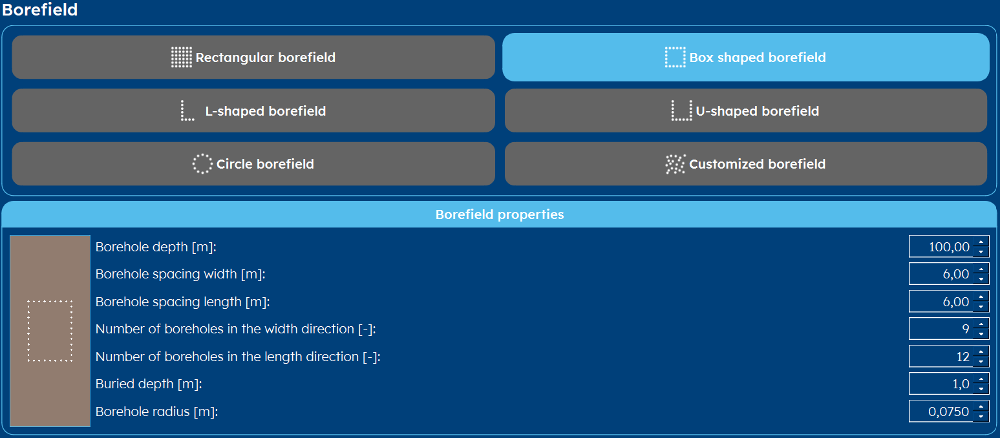
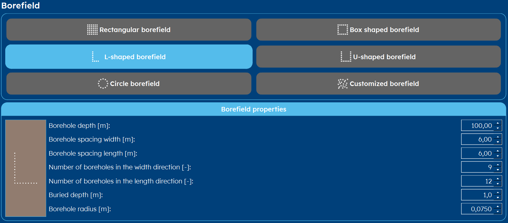
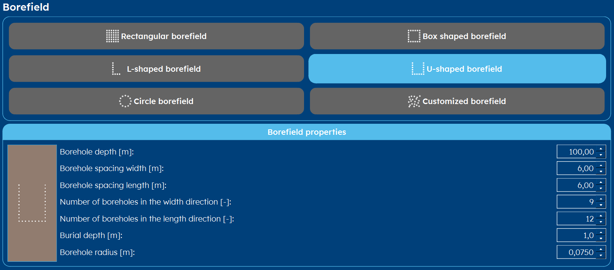
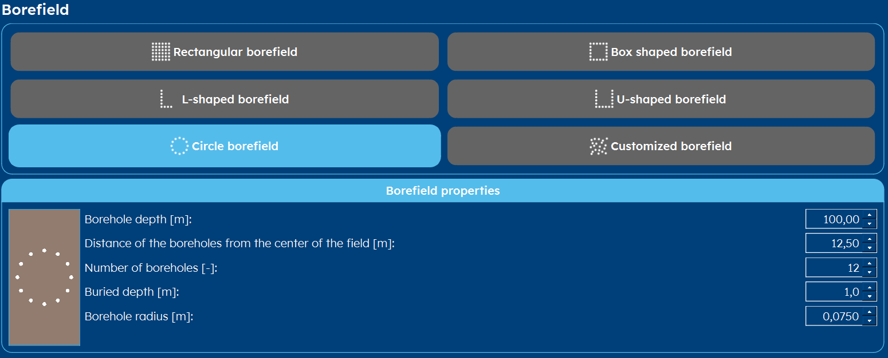
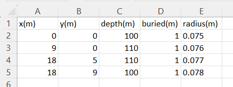

.. _tab borefield:

Borefield
#########

Within GHEtool Pro, there is a lot of flexibility w.r.t. the borefield configuration.
Instead of working with a predetermined number of configurations, which is fixed, GHEtool offers you the most flexibility
for choosing the exact borefield for your project.

Not enough options? Chose specific coordinates for your drilling using a :ref:`custom configuration`!

Rectangular configuration
*************************
If you want to use a classic rectangular borefield (or a line field, which is just a rectangle with one side having length 1),
you select *rectangular borefield*. The parameters you have to enter are:

.. include:: ../General/borefield_general_description.rst

Box configuration
*****************
A boxed borefield is a rectangular borefield where the center boreholes are left out.
This can for example be used when there is a central building around which the boreholes are being placed.

.. include:: ../General/borefield_general_description.rst

L configuration
***************

.. include:: ../General/borefield_general_description.rst

U configuration
***************

.. include:: ../General/borefield_general_description.rst

Circular configuration
**********************

* **Borehole depth [m]** The depth of the borehole in meters, relative to the buried depth.

.. caution::
    Please note that the borehole depth is relative to the burial depth, as is used in the convention by Here the convention of (Cimmino and Bernier, 2014) [1]_.
    So if you have a burial depth of 1m and a borehole depth of 100m, the total drilled depth is 101m.

* **Distance of the boreholes from the center of the field [m]** The radius at which the boreholes are drilled relative to the center
  of the circle in meters.

* **Number of boreholes [-]** The number of boreholes in the circular borefield.

* **Buried depth [m]** The level at which the borehole starts, relative to the ground level. It can be seen as the
  depth at which the horizontal pipes are installed.

* **Borehole radius [m]** This is the radius of the drilled hole, which is typically between 0,06-0,1m.

.. _custom configuration:

Custom configuration
********************
If you have a very complex project that does not fit into one of the categories above,
you can set a borefield using the specific borehole coordinates and set the parameters for each borehole
individually.

This can be done both :ref:`manually` or you can :ref:`import a borefield from csv`.

.. image:: Figures/borefield_custom.png
  :alt: Custom borefield

.. _manually:

Manually
========
For smaller custom borefields, you can enter them directly into GHEtool, by clicking the '+' icon.
This duplicates the current row to the row underneath. Here you can change the following parameters:

* **x [m]** The x-coordinate of the borehole in meters.
* **y [m]** The y-coordinate of the borehole in meters.
* **Depth [m]** The depth of the borehole in meters, relative to the buried depth.
* **Buried depth [m]** Every borehole can have a different buried depth (in meters). If, for example, a couple of boreholes are located
  under a road, they are buried at another level.
* **Borehole radius [m]** It is possible to set a custom radius for each borehole (in meters). However, most of the time, this is constant for the whole field.

.. _import a borefield from csv:

Import a borefield from csv
===========================
For larger borefields, it can be easier to create the custom borefield elsewhere (for example in Excel, see :ref:`create custom borefield` for a tutorial) and import it here.

.. note::
    The csv-file should have have all the columns (x, y, depth, buried depth and radius) like in the figure below.

.. tip::
    Click :download:`here <Figures/Data.csv>` to download an example format.

#. Open the file where you have entered the borefield data
#. Select the correct separator of the csv-file and decimal sign
#. Press load and your borefield should be automatically imported. Now you can change it to whatever you want.

.. tip::
    If you don't see your borefield loaded in correctly, try to change your separator or decimal sign and try loading again.
    This is a common issue.

.. warning::
    Be careful when setting a custom borefield. If you have two boreholes overlapping, you will get an error message.

.. rubric:: References
.. [1] Massimo Cimmino, Michel Bernier, A semi-analytical method to generate g-functions for geothermal bore fields, International Journal of Heat and Mass Transfer, Volume 70, 2014, Pages 641-650, ISSN 0017-9310, https://doi.org/10.1016/j.ijheatmasstransfer.2013.11.037.
