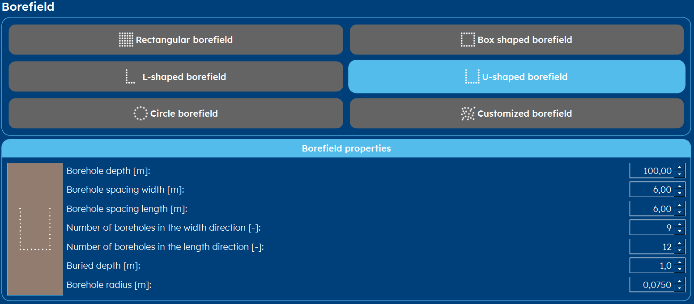

.. _tab borefield:

Borefield
#########

Within GHEtool Pro, there is a lot of flexibility w.r.t. the borefield configuration.
Instead of working with a predetermined number of configurations, which is fixed, GHEtool offers you the most flexibility
for choosing the exact borefield for your project.

Not enough options? Chose specific coordinates for your drilling using a :ref:`custom configuration`!

Rectangular configuration
*************************
If you want to use a classic rectangular borefield (or a line field, which is just a rectangle with one side having length 1),
you select *rectangular borefield*. The parameters you have to enter are:

.. include:: ../General/borefield_general_description.rst

.. image:: Figures/borefield_rectangular.png
  :alt: Rectangular borefield

Box configuration
*****************
A boxed borefield is a rectangular borefield where the center boreholes are left out.
This can for example be used when there is a central building around which the boreholes are being placed.

.. include:: ../General/borefield_general_description.rst

.. image:: Figures/borefield_box.png
  :alt: Boxed borefield

L configuration
***************
If you have only half a box field, the borefield has the form of the letter 'L'.

.. include:: ../General/borefield_general_description.rst

.. image:: Figures/borefield_L.png
  :alt: L-shaped borefield

U configuration
***************
The last 'standard' options is to have a borefield in the form of the letter 'U'.

.. include:: ../General/borefield_general_description.rst

Circular configuration
**********************

.. image:: Figures/borefield_circle.png
  :alt: Circular borefield

.. _custom configuration:

Custom configuration
********************

.. image:: Figures/borefield_custom.png
  :alt: Custom borefield

Import a borefield from csv
===========================

.. rubric:: References
.. [1] Massimo Cimmino, Michel Bernier, A semi-analytical method to generate g-functions for geothermal bore fields, International Journal of Heat and Mass Transfer, Volume 70, 2014, Pages 641-650, ISSN 0017-9310, https://doi.org/10.1016/j.ijheatmasstransfer.2013.11.037.