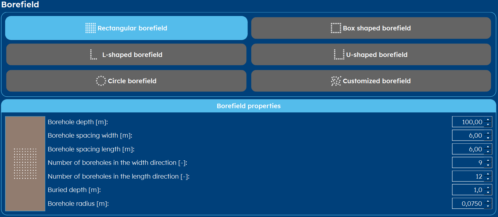
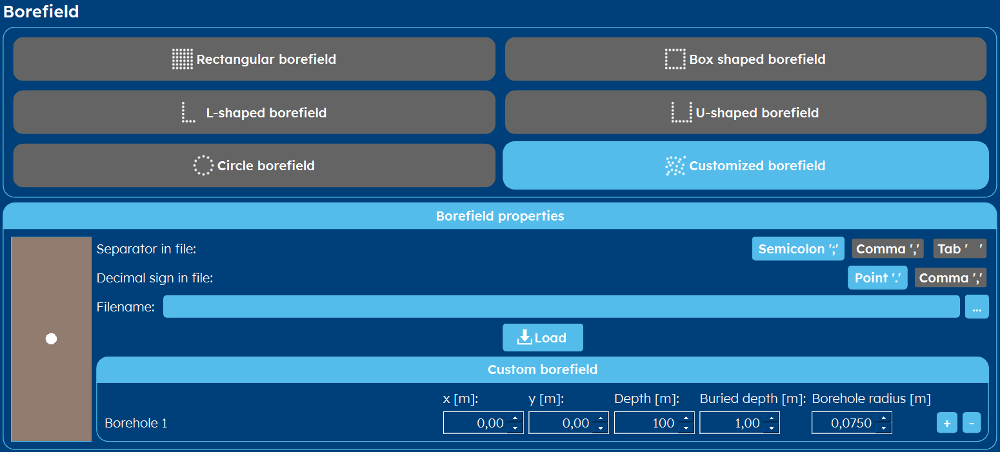

.. _tab borefield:

Borefield
#########

Within GHEtool Pro, there is a lot of flexibility w.r.t. the borefield configuration.
Instead of working with a predetermined number of configurations, which is fixed, GHEtool offers you the most flexibility
for choosing the exact borefield for your project.

Not enough options? Chose specific coordinates using a :ref:`custom configuration`!

Rectangular configuration
*************************

Box configuration
*****************

.. image:: Figures/borefield_box.png
  :alt: Boxed borefield

L configuration
***************

.. image:: Figures/borefield_L.png
  :alt: L-shaped borefield

U configuration
***************

.. image:: Figures/borefield_U.png
  :alt: U-shaped borefield

Circular configuration
**********************

.. _custom configuration:

Custom configuration
********************

Import a borefield from csv
===========================
