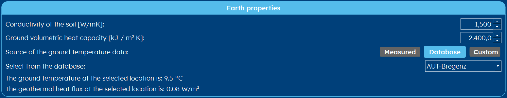
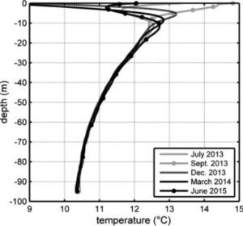
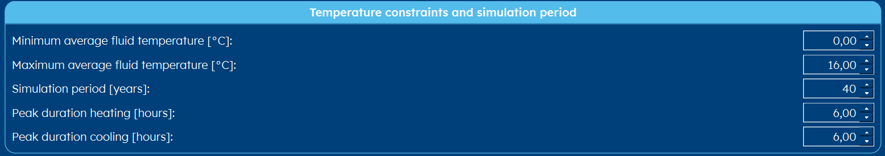

.. _tab earth:

Earth
#####
The earth tab contains information w.r.t. the ground parameters and also the temperature restrictions.
Both are explained below.

Earth properties
================
All borefield calculations start with a correct estimation of the ground temperature.

.. caution::
    The *undisturbed ground temperature* model, as is used the database and in the Custom ground data, is far from accurate.
    This model assumes a certain ground temperature and a linear temperature increase in function of depth, due to the
    inherent geothermal gradient.

    |gradient|

    Nowadays, especially in city centers, one can notice a big increase in ground temperatures near the surface, do to all the
    buildings. Here, if you go deeper, the temperature **decreases** instead of **increases** (Radioti et al., 2017) [1]_. This cannot be captured within
    a simple model and it is therefore suggested to do TRT-tests whenever you are doing a project nearby a densely built-up area.

Temperature constraints and simulation period
=============================================
Here you enter parameters w.r.t. the temperature boundaries.
Since it is important that over time the ground temperature stays between certain limits,
this information is asked on this page.

* **Minimum average fluid temperature [°C]** The minimum average fluid temperature (i.e. the temperature in heating)
* **Maximum average fluid temperature [°C]** The maximum average fluid temperature (i.e. the temperature in cooling)

.. include:: ../General/caution_temperatures.rst

* **Simulation period [years]** The simulation period in years, oftentimes between 20-60 years.
* **Peak duration heating [hours]** The duration of the peak in heating. For slower emission systems, this is longer.
* **Peak duration cooling [hours]** The duration of the peak in cooling. For slower emission systems, this is longer and typically lower than the duration for the heating peak.

.. note::
    Please note that the peak duration heating and peak duration cooling option is not always visible.
    It can be hidden when you use calculate using hourly data.

.. rubric:: References
.. [1] G. Radioti, K. Sartor, R. Charlier, P. Dewallef, F. Nguyen, Effect of undisturbed ground temperature on the design of closed-loop geothermal systems: A case study in a semi-urban environment, Applied Energy, Volume 200, 2017, Pages 89-105, ISSN 0306-2619, https://doi.org/10.1016/j.apenergy.2017.05.070.