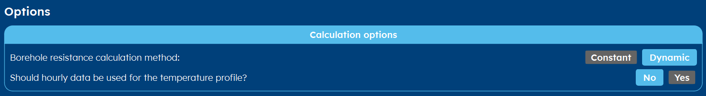
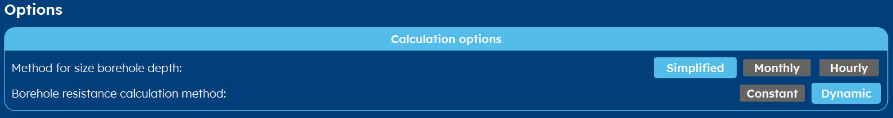
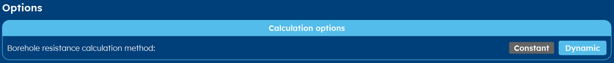
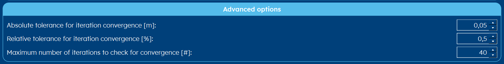

.. _tab options:

Options
#######
The options tab gives you control over the aim-specific settings. Those are explained in the sections below.
Furthermore, you can change some advanced settings w.r.t. the background of GHEtool. These are explained in the last section: :ref:`advanced options`.

Determine temperature profile
*****************************

* Here you can select if the borehole thermal resistance is constant or it should be calculated dynamically.
  This has an effect on the :ref:`thermal resistance` tab. If for example a thermal response test (TRT) has been carried out,
  the borehole thermal resistance has been measured and can be assumed constant. Any other time, you would want it to be dynamic.

* If you have an hourly load profile available and you want the temperature profile to be shown in an hourly resolution,
  you can check this last parameter to 'True'.

Determine required depth
************************

.. _sizing methods:

Sizing methods
==============
The calculation of the required borehole depth can be done using three different methodologies:

Simplified
----------
The simplified method is the fastest method (Peere et al., 2023) [1]_ and most of the time it is accurate enough.
It reduces the total load to three pulses: 1) a yearly imbalance, 2) a monthly peak load and 3) a monthly average load.
This simplified method is based on the work of (Peere W., 2020) [2]_ and (Peere et al., 2021) [3]_.

Monthly
-------
The monthly method is the most accurate methodology for monthly load data. It calculates the depth using the peak and average load
for each month, hence 24 peaks per year.

.. note::
    The monthly method is also the methodology used when calculating the temperature profile and optimising the load profile.

Hourly
------
When the project has been dynamically simulated, this building demand profile can be used to size the borefield.

.. seealso::
    When you select the hourly option, part of the interface is disabled. Before you can add new scenario's etc.
    you have to set the hourly load profile here: :ref:`thermal demand`.

.. caution::
    It is not because you use data with a high resolution that the sizing will be more realistic.
    Everything depends on the trustworthiness of your thermal demands. Sometimes, having a trustworthy monthly demand profile
    can give better results than a bad hourly resolution.

Other options
=============

* Here you can select if the borehole thermal resistance is constant or it should be calculated dynamically.
  This has an effect on the :ref:`thermal resistance` tab. If for example a thermal response test (TRT) has been carried out,
  the borehole thermal resistance has been measured and can be assumed constant. Any other time, you would want it to be dynamic.

.. Caution::
    In this method it is strongly advised to use the dynamic calculation of the borehole thermal resistance.
    Since the thermal resistance is a function of the borehole depth, assuming it constant in this method can lead to wrong results.

.. include:: ../General/warning_required_depth.rst

Optimise load profile
*********************

* Here you can select if the borehole thermal resistance is constant or it should be calculated dynamically.
  This has an effect on the :ref:`thermal resistance` tab. If for example a thermal response test (TRT) has been carried out,
  the borehole thermal resistance has been measured and can be assumed constant. Any other time, you would want it to be dynamic.

.. _advanced options:

Advanced options
****************

Most of the methods within GHEtool Pro are iterative, meaning that they do the same calculation over and over again until
a certain criterium is met. In the advanced options, you can alter these criteria if you want a more accurate or a faster result.
These options also influence the occurence of errors since, for example, allowing less iterations before convergence, will lead
to more convergence errors.

.. note::
    These advanced options are only visible if you allow them on the :ref:`settings` tab.

.. rubric:: References
.. [1] Peere, W., Hermans, L., Boydens, W., and Helsen, L. (2023). Evaluation of the oversizing and computational speed of different open-source borefield sizing methods. In Proceedings of International Building Simulation Conference 2023. Shanghai (Belgium), 4-6 September 2023.
.. [2] Peere, W., Picard, D., Cupeiro Figueroa, I., Boydens, W., and Helsen, L. (2021) Validated combined first and last year borefield sizing methodology. In Proceedings of International Building Simulation Conference 2021. Brugge (Belgium), 1-3 September 2021. https://doi.org/10.26868/25222708.2021.30180
.. [3] Peere, W. (2020). Methode voor economische optimalisatie van geothermische verwarmings- en koelsystemen. Master thesis, Department of Mechanical Engineering, KU Leuven, Belgium.
