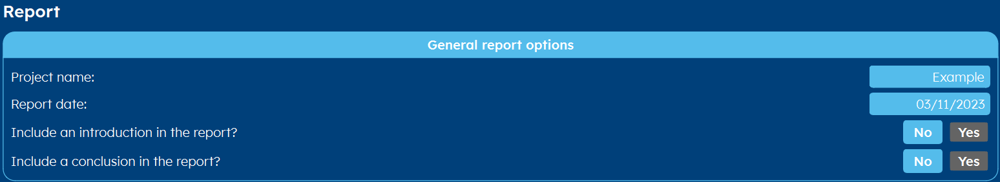

.. _tab report:

Report
######
Once everything is calculated, GHEtool Pro gives you the option to export all your scenario's
automatically to a PDF-document. In this tab you can control how this document is created, in two steps:
:ref:`general settings` and :ref:`scenario-specific settings`.

.. _general settings:

General settings
================
In the first category, you can set the title of the report and the report date. You also have to option to add an introduction
to your report even as a conclusion. To do so, press *yes* next to respectively 'introduction' and 'conclusion'.
A textbox will open where you can enter the report information you want.

.. hint::
    If you want to start a sentence on a new line in the introduction or conclusion, type ' ' between those two lines.
    This will cause a line break. This can also be seen since the text after ' ' will turn green.

.. _scenario-specific settings:

Scenario-specific settings
==========================
Each scenario has its own settings, determining how it will be displayed in the final report.

* **Should this scenario be included in the report?** If you have calculated a scenario for yourself, that was not part of the
  final project, you can exclude it from the report by clicking *No* to this question.

* **Show the borehole coordinates in the report?** If you have a very specific borefield design, or it is a rather large project,
  it can be interesting to add the coordinates to the report. If you click *No* the report will just mention the number of boreholes
  and there average minimum distance from each-other, but if you choose to include the borehole coordinates in the report,
  it will be shown as follows:

* **Description of the scenario** There you can enter the text that will be shown on top of each scenario in the report.
  You can write the rationale behind the scenario below, some design choices or even the cost estimate.
