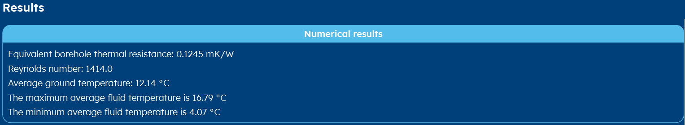
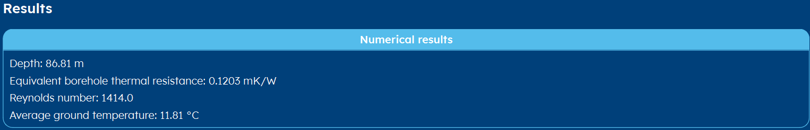
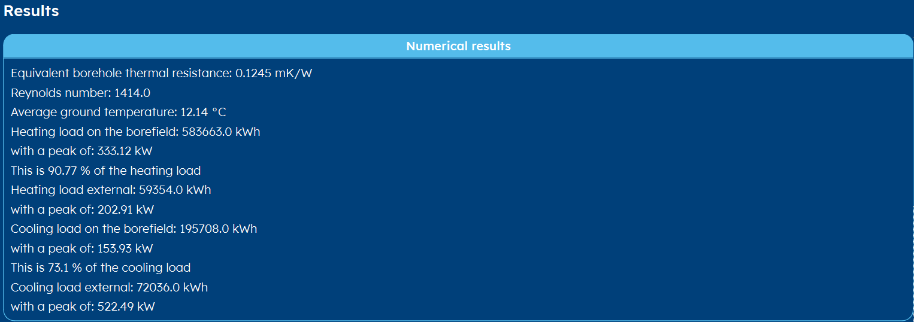

.. _tab results:

Results
#######
The result page shows the results of the calculation of the current, selected scenario.
The top part shows numerical results, whereas the other categories show figures.
Since the results are depending on the :ref:`tab aim` of the scenario, they are described below in three sections.

Not calculated
==============
If you go to the result tab without first calculating the scenario, you will receive a 'not calculated' message.
It is necessary that after every change you made to a scenario, you run the calculations again.

Determine temperature profile
=============================
Below you can find an example of the *numerical results* section for the 'determine temperature profile' aim.

The shown maximum and minimum temperatures are taken over the whole simulation period in peak load for cooling and heating.

.. note::
    Note that your results might differ, since for example the average ground temperature is not shown when a measured
    ground temperature is used (see :ref:`tab earth` tab) nor is the borehole equivalent resistance and reynolds number shown
    when a constant borehole resistance is assumed (see :ref:`tab options` tab).

Determine required depth
========================
Below you can find an example of the *numerical results* section for the 'calculate required depth' aim.
This is rather equal to the numerical results of the 'determine temperature profile' aim, except here the required depth is shown.

.. note::
    Note that your results might differ, since for example the average ground temperature is not shown when a measured
    ground temperature is used (see :ref:`tab earth` tab) nor is the borehole equivalent resistance and reynolds number shown
    when a constant borehole resistance is assumed (see :ref:`tab options` tab).

.. caution::
    This method is also vulnerable to errors. See the section :ref:`errors` below to learn more.

Optimise load profile
=====================
The optimised load profile results show you what percentage of the total heating and cooling load can be fulfilled geothermally,
and what the corresponding geothermal peak in heating and cooling is. Also, it is shown what percentage of the load should be put
onto another heating or cooling system.

These results hence can be used to start designing an intelligent hybrid system centered around a geothermal borefield.

Errors
======
It is possible that no results are shown, but that you see an error. Please go to our :ref:`errors` section to learn more.
