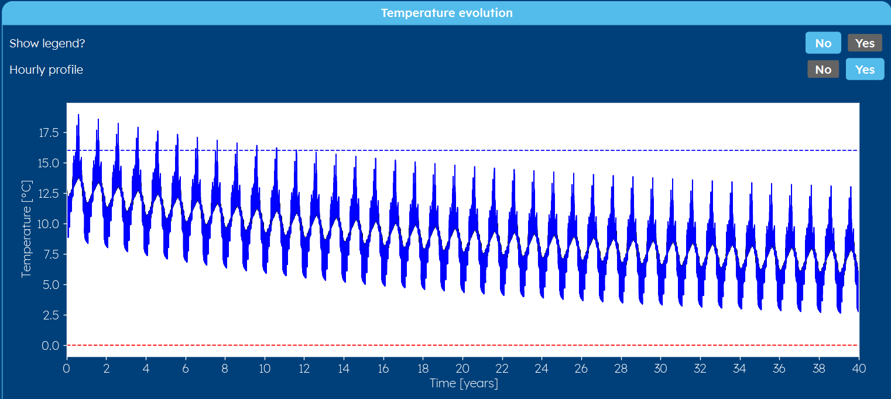
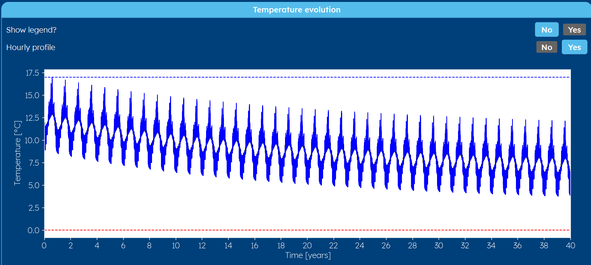
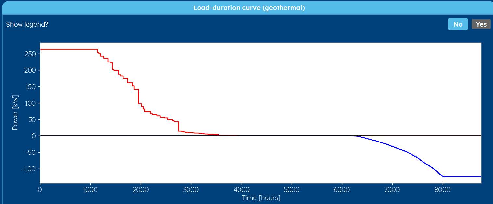

.. _tab results:

Results
#######
The result page shows the results of the calculation of the current, selected scenario.
The top part shows numerical results, whereas the other categories show figures.
Since the results are depending on the :ref:`tab aim` of the scenario, they are described below in three sections.

Not calculated
==============
If you go to the result tab without first calculating the scenario, you will receive a 'not calculated' message.
It is necessary that after every change you made to a scenario, you run the calculations again.

.. image:: Figures/results_not_calculated.png
  :alt: Message if the results are not yet calculated

Determine temperature profile
=============================
Below you can find an example of the *numerical results* section for the 'determine temperature profile' aim.

.. image:: Figures/numerical_results_temp_profile.png
  :alt: Numerical results for the temperature profile

The shown maximum and minimum temperatures are taken over the whole simulation period in peak load.

.. note::
    Note that your results might differ, since for example the average ground temperature is not shown when a measured
    ground temperature is used (see :ref:`tab earth` tab) nor is the borehole equivalent resistance and reynolds number shown
    when a constant borehole resistance is assumed (see :ref:`tab options` tab).

You also see a temperature profile like the one below.

    .. image:: Figures/results_monthly_temperature_profile.png
      :alt: Monthly temperature profile

.. note::
    If you work with monthly data (see also :ref:`options` tab), you don't see the option of an hourly profile.
    If you set this button to 'yes', you see the image below.

    |hourly|

    The reason this hourly profile is not shown from the beginning, is due to the loading time. A monthly profile is way faster
    to display, than the hourly one, since the first one has way less pulses to display.

.. caution::
    You also see a load duration curve if you selected hourly data in the :ref:`options` tab, but this curve is wrong, due
    to a bug in the current version of GHEtool (`read more <https://github.com/wouterpeere/GHEtool/issues/189>`_). This will be fixed in the next version.

Determine required depth
========================
Below you can find an example of the *numerical results* section for the 'calculate required depth' aim.
This is rather equal to the numerical results of the 'determine temperature profile' aim, except here the required depth is shown.

.. image:: Figures/numerical_results_req_depth.png
  :alt: Numerical results for the required depth aim

.. note::
    Note that your results might differ, since for example the average ground temperature is not shown when a measured
    ground temperature is used (see :ref:`tab earth` tab) nor is the borehole equivalent resistance and reynolds number shown
    when a constant borehole resistance is assumed (see :ref:`tab options` tab).

.. caution::
    This method is also vulnerable to errors. See the section :ref:`errors` below to learn more.

You also see a temperature profile like the one below. This profile looks very similar to the profile one gets from
calculating the temperature profile, but here, the temperature profile touches the temperature limits somewhere.

    .. image:: Figures/results_req_depth.png
      :alt: Monthly temperature profile for calculate required depth

.. note::
    If you work with monthly data (see also :ref:`options` tab), you don't see the option of an hourly profile.
    If you set this button to 'yes', you see the image below.

    |hourly_req|

    The reason this hourly profile is not shown from the beginning, is due to the loading time. A monthly profile is way faster
    to display, than the hourly one, since the first one has way less pulses to display.

Optimise load profile
=====================
The optimised load profile results show you what percentage of the total heating and cooling load can be fulfilled geothermally,
and what the corresponding geothermal peak in heating and cooling is. Also, it is shown what percentage of the load should be put
onto another heating or cooling system.

These results hence can be used to start designing an intelligent hybrid system centered around a geothermal borefield.

.. image:: Figures/numerical_results_optimise.png
  :alt: Numerical results for optimise load profile.

You also see a temperature profile like the one below. Most of the times, the temperature profile touches both the maximum
and the minimum allowed average fluid temperature.

    .. image:: Figures/results_optimise.png
      :alt: Monthly temperature profile for calculate required depth

.. caution::
    If you select hourly in the temperature profile category, you potentially see a temperature peak that crosses this temperature
    limit. This is do to that fact that in the background, this 'optimise load profile' method uses a monthly temperature calculation
    (see also :ref:`tab aim` tab).

You also see the load duration curve of the load that is put onto the borefield. You can see that this load is topped off
at a certain power, which can be read in the numerical results on top of the results tab.

Errors
======
It is possible that no results are shown, but that you see an error. Please go to our :ref:`errors` section to learn more.
