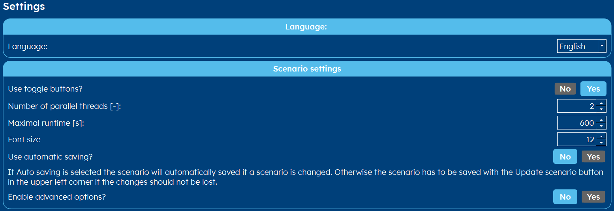

.. _tab settings:

Settings
########
In this settings tab, you can alter the general behaviour of GHEtool Pro.

* **Language** Select the language of the interface. Currently, English, German and Dutch are the ones with 100% coverage.
  This language is also the language that is used for the report.

* **Use toggle buttons?** This relates to the behaviour of the buttons. If you have toggle enabled, when you click on an
  already selected button, the selection will 'jump' to the other, currently unselected option. If you disable this behaviour
  the selected button will stay the same.

* **Number of parallel threads [-]** To save time when having multiple scenario's, GHEtool Pro can calculate in multiple
  threads to save time.

* **Maximal runtime [s]** Some methods can take quite some time. This is the maximum time a method can run, so the program
  does not get stuck forever.

* **Font size** Depending on your windows settings, it can be of interest to you to increase the font size of the interface.

* **Use automatic saving** Normally, whenever you change a scenario, you have to press 'update scenario' to save these changes.
  If you enable this option, this is no longer needed. However, we would suggest leaving this feature off, so you can keep better
  track of all the changes you made.

* **Enable advanced options?** This enables the advanced options in the :ref:`tab options` tab.
