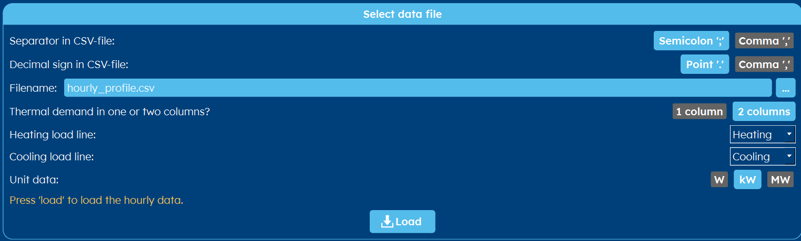

.. _tab thermal demand:

Thermal Demand
##############
GHEtool can handle two types of thermal demand profiles: monthly based demand profiles and hourly profiles.
Depending on your aim or on the options you selected in the :ref:`tab options` tab, the screen you see will differ.
This page is made up of (potentially) three categories: :ref:`load profile`, :ref:`load type` and :ref:`thermal demands`.
These are explained below.

.. _load profile:

Select data file
================
If you have an hourly profile available, you can load it into GHEtool for direct use in hourly methodologies or to be converted
to a monthly profile (cf. infra).

.. note::
    The *load* button is hidden when you selected an aim that requires hourly data of you selected an option that demands an hourly profile.

.. caution::
    If you want to use an hourly profile, but you didn't select it in the :ref:`tab options` tab, it will use the data provided
    in the *Thermal demands* category (cf. infra). Click the *load* button to convert the hourly load into a monthly load, which
    will fill this table so the program works with the data you intended.

To import an hourly profile, select the three dots next to file name and go to the location of your file.

Once opened, GHEtool normally sets the separator and decimal sign itself.

.. caution::
    Working with hourly data requires some caution.

    First of all, the hourly profile may only contain one or two columns and 8760 rows (excl. header).

    Secondly, make sure you know what separator and decimal sign characters are, so you can select them correctly in GHEtool.

    For more information, go to the article on errors: :ref:`errors`.

.. tip::
    You can download an example hourly profile :download:`here <Figures/hourly_profile.csv>`.

Here you can select if you want to use data in one or two columns (mostly it is two) and select the correct unit for your data.
It is possible to load data that is in [W], [kW] and even [MW]. If you want to convert it into monthly data, you now can press the *load* button.

.. _load type:

Load type
=========
GHEtool can work with both geothermal loads (i.e. primary loads) and building (i.e. secundary loads).
In this category, you can select if you want to use geothermal or building loads. You have also the option to add domestic hot water (DHW)
on top of your (hourly) load.

.. note::
    For the aim of optimising your load profile (see tab :ref:`tab aim`), you don't have the option to put in geothermal loads
    neither can you include DHW. If you want DHW to be incorporated in this method, you need to put it explicitly in the csv-file.

.. _thermal demands:

Monthly profile
===============
Typically, you don't have hourly data available so you provide both monthly heating and cooling loads and peaks manually.

.. note::
    The *Thermal demands* category will be hidden when you selected an aim that requires hourly data of you selected an option that demands an hourly profile.

