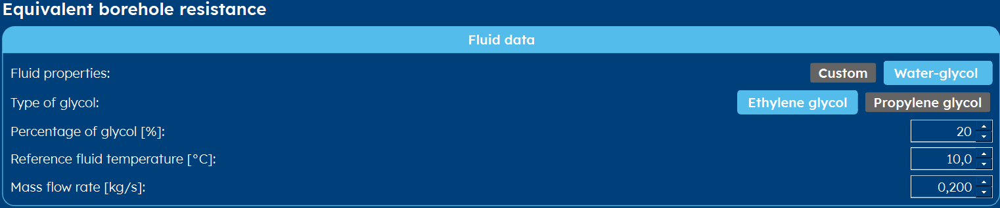

.. _tab thermal resistance:

Thermal Resistance
##################
The borehole equivalent thermal resistance (Rb*) tab has two major differing layouts: the one where you can enter a :ref:`constant`
borehole equivalent thermal resistance (see also are FAQ: :ref:`TRT`) and the one with a lot of flexibility: the :ref:`dynamic` page.
The view you see, is determined in the :ref:`tab options` tab.

.. _constant:

Constant
========
When you have measured (or estimated) a certain constant borehole equivalent thermal resistance, you can enter it here.
Typically, this value ranges from 0.05-0.25.

.. image:: Figures/borehole_resistance_constant.png
  :alt: Input for the constant borehole thermal resistance

.. include:: ../General/warning_TRT.rst

.. _dynamic:

Dynamic
=======
Most of the time, however, you are working with a Rb* that is calculated dynamically. This gives you the flexibility of playing
around with certain parameters and really get a feel of how they influence the borehole equivalent resistance.
In order to be able to calculate the resistance, you have to enter values w.r.t. the :ref:`fluid parameters` and values
w.r.t. the :ref:`borehole internals`.

.. hint::
    You can vary the pipe and fluid parameters and immediately see the effect
    on the equivalent borehole thermal resistance below.

.. _fluid parameters:

Fluid parameters
----------------
The fluid parameters can be set either by using a certain % of glycol to form a water-glycol mixture or by setting the fluid parameters all by yourself.

.. caution::
    Be aware that there may be regulatory rules in your region w.r.t. what fluids you can use for geothermal applications.

* **Type of glycol** Select the type of glycol you want to use.
* **Percentage of glycol [%]** The percentage of glycol in the glycol-water mixture.
* **Reference fluid temperature [°C]** The reference temperature for the fluid properties.
* **Mass flow rate [kg/s]** Mass flow rate per borehole.

If you have a very specific fluid, you can enter its properties directly into GHEtool if you select *Custom* in the *Fluid properties* input.

* **Thermal conductivity [W/mK]** Thermal conductivity of the fluid.
* **Density [kg/m³]** Density of the fluid.
* **Thermal capacity [J/kgK]** Thermal heat capacity of the fluid.
* **Dynamic viscosity [Pa s]** Dynamic viscosity of the fluid.
* **Mass flow rate [kg/s]** Mass flow rate per borehole.

.. warning::
    Please make sure you enter the **dynamic** viscosity and not the **kinematic** viscosity.
    You can convert one into another by using: :math:`\mu = \nu \cdot \rho`, where:

    * :math:`\mu` is the dynamic viscosity [Pa s] (= [Ns/m²])
    * :math:`\nu` is the kinematic viscosity [m²/s]
    * :math:`\rho` is the density [kg/m³]

.. note::
    The **Mass flow rate** within GHEtool is the mass flow rate per borehole. This means that if you have for example 0.2kg/s of
    flow rate and a double U-tube, this gives 0.1kg/s of flow through each tube. If you have a single U-tube, this 0.2kg/s will pass
    through this single U-tube.

.. hint::
    If you want to take into account a higher flow rate when working with a series connection of borehole, you enter the resulting
    fluid mass flow rate into GHEtool. For example, you have a total mass flow rate of 0.4kg/s for 4 boreholes, with 2x2 in series,
    you enter 0.2kg/s as a mass flow rate into GHEtool.

.. note::
    Within GHEtool, you can set a reference temperature for your fluid parameters (see :ref:`tab thermal resistance`), which
    has an influence on the Reynolds number and hence the thermal behaviour of your system. By default, this reference temperature is 10°C,
    which is more or less the undisturbed ground temperature.

    If you want a more conservative approach, you can set this temperature to the maximum or minimum average fluid temperature.
    In that case you are sure that, whenever the thermal resistance matters the most (i.e. during the peak loads), they are calculated
    with the worst case fluid parameters.

.. _borehole internals:

Borehole internals
------------------
For borehole internals, there are two major options: using U-tubes or using a coaxial pipe.

* **Number of pipes [-]** The number of U-tubes in the borehole.
* **Grout thermal conductivity [W/mK]** Thermal conductivity of the grout.
* **Pipe thermal conductivity [W/mK]** Thermal conductivity of the pipe. (This mostly stays unchanged.)
* **Inner pipe radius [m]** The inner radius of the pipe in meter.
* **Outer pipe radius [m]** The outer radius of the pipe in meter.
* **Borehole radius [m]** Radius of the borehole in meter. (This input is duplicated from the :ref:`tab borefield` tab.)
* **Distance of pipe until center [m]** This is an estimation of the locations of the pipe inside the borehole.
* **Pipe roughness [m]** The roughness of the pipe. Most of the times, since we are working with PE, this is very small.

.. include:: ../General/pipe_roughness.rst

* **Grout thermal conductivity [W/mK]** Thermal conductivity of the grout.
* **Pipe thermal conductivity [W/mK]** Thermal conductivity of the pipe. (This mostly stays unchanged.)
* **Inner pipe inner radius [m]** The inner radius of the inner pipe in meter.
* **Inner pipe outer radius [m]** The inner radius of the outer pipe in meter.
* **Outer pipe inner radius [m]** The outer radius of the inner pipe in meter.
* **Outer pipe outer radius [m]** The outer radius of the outer pipe in meter.
* **Borehole radius [m]** Radius of the borehole in meter. (This input is duplicated from the :ref:`tab borefield` tab.)
* **Pipe roughness [m]** The roughness of the pipe. Most of the times, since we are working with PE, this is very small.

.. include:: ../General/pipe_roughness.rst
