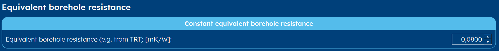

.. _tab thermal resistance:

Thermal Resistance
##################
The borehole equivalent thermal resistance (Rb*) tab has two major differing layouts: the one where you can enter a :ref:`constant`
borehole equivalent thermal resistance (see also are FAQ: :ref:`TRT`) and the one with a lot of flexibility: the :ref:`dynamic` page.
The view you see, is determined in the :ref:`tab options` tab.

.. _constant:

Constant
========
When you have measured (or estimated) a certain constant borehole equivalent thermal resistance, you can enter it here.
Typically, this value ranges from 0.05-0.25.

.. include:: ../General/warning_TRT.rst

.. _dynamic:

Dynamic
=======
Most of the time, however, you are working with a Rb* that is calculated dynamically. This gives you the flexibility of playing
around with certain parameters and really get a feel of how they influence the borehole equivalent resistance.
In order to be able to calculate the resistance, you have to enter values w.r.t. the :ref:`fluid-parameters` and values
w.r.t. the :ref:`borehole-internals`.

.. hint::
    You can vary the pipe and fluid parameters and immediately see the effect
    on the equivalent borehole thermal resistance below.

Fluid parameters
----------------

.. image:: Figures/borehole_resistance_fluid_custom.png
  :alt: Input for the custom fluid parameters

.. image:: Figures/borehole_resistance_fluid_glycol.png
  :alt: Input for the fluid glycol parameters

Borehole internals
------------------

.. image:: Figures/borehole_resistance_U.png
  :alt: Input for the U-pipes in the borehole

.. image:: Figures/borehole_resistance_coaxial.png
  :alt: Input for the coaxial pipe parameters