.. _eed data::

How to convert EED data to GHEtool?
###################################
Earth Energy Designer (or EED in short) is the first and most used geothermal sizing software in Europe, so it can happen
that your competitor or client is working with this software instead. Although the features of EED differ (quite a lot)
from those one finds within GHEtool (see also `are FAQ <https://ghetool.eu/faq/>`_), it is possible to convert an EED
project to a GHEtool project. The only thing you need to ask for is the EED data export file like for example :download:`this one <Figures/EED_example.txt>`.
In this article we will go over the different conversion steps if you want to work on an EED project within GHEtool.

.. note::
    Currently, a method to load EED data directly into GHEtool is in development. For the time being however,
    some manual input is required.

Input values
=============
To input the values from the EED export file into GHEtool, it is best to read the document from top to bottom, so
you don't miss any information. The different sections that appear in the EED export file are mentioned in order below.

.. caution::
    Please select the 'Determine temperature profile' aim in the :ref:`tab aim` tab.

Ground
------
The first data you come across in the export, is the ground data. This can be entered within GHEtool in the :ref:`tab earth` tab.

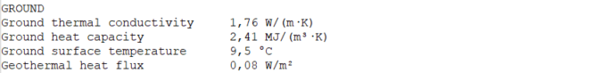

* **Ground thermal conductivity** can be directly set in GHEtool.
* **Ground heat capacity** can be directly set in GHEtool.
* **Ground surface temperature** if you select *custom* you can set the surface temperature.
* **Geothermal heat flux** if you select *flux*, you can set the geothermal heat flux.

The result within GHEtool looks like this:

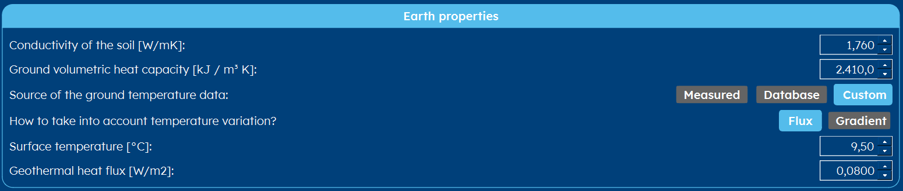

Borehole
--------
The next section you see, is related to the borehole internals and configuration. First we will input the borefield data
in the :ref:`tab borefield` tab.

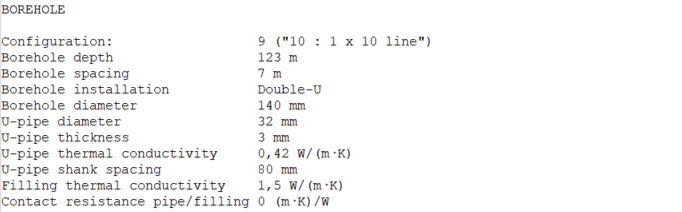

* **Configuration** tells you something about the borefield configuration. In this case, we have a borefield with 1 borehole in the width
  direction and 10 in the length direction. You can set this directly in GHEtool.
* **Borehole depth** you can set this directly in GHEtool.

.. note::
    If you don't see the borehole depth, please select 'Determine temperature profile' in the :ref:`tab aim` tab.

* **Borehole spacing** you can set this directly in GHEtool

.. caution::
    EED works with a limited number of possible borefields, with **equal spacing** in both length and width direction.
    The borehole spacing you find in the EED export should therefore always be used for both spacings within GHEtool.

* **Borehole diameter** In GHEtool you need to set the borehole radius, so you need to divide this diameter by 2.

If you do so, you get the result below:

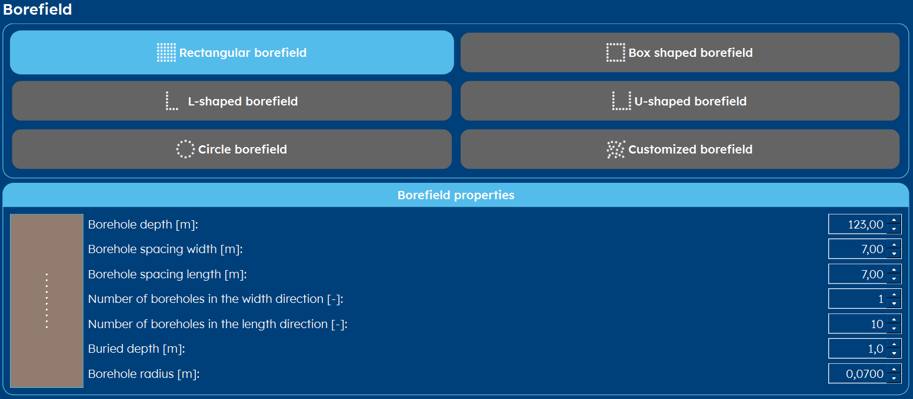

.. note::
    As you can see, EED does not have a parameter for the *buried depth*. This can lead to some (minor) variation
    in the result, since the buried depth is used to estimate the heat losses to the earths surface.

Next, you need to open the :ref:`tab thermal resistance` tab.
If you don't see the possibility to enter the borehole internals there, you need to set the borehole thermal resistance to *dynamic*
in the :ref:`tab options` tab like explained here: :ref:`borehole internals`.

* **Borehole installation** can be directly set in GHEtool using the toggle button *Borehole internals* and the *Number of pipes [-]* input.
* **U-pipe diameter** GHEtool requires a pipe radius, so you need to divides this value by 2 to get the *outer pipe radius*.
* **U-pipe thickness** GHEtool works with inner and outer radii, so you can get the *inner pipe radius* by substracting the pipe thickness from the outer pipe radius.
* **U-pipe thermal conductivity** can directly be set in GHEtool.
* **U-pipe shank spacing** GHEtool works with a pipe distance from the center. This is simple half of the shank spacing.
* **Filling thermal conductivity** can be set in GHEtool as the *grout thermal conductivity*
* **Contact resistance pipe/filling** is not an input parameter in the GHEtool pipe model.

.. note::
    The pipe roughness is not an input parameter within EED, but it is used to determine accurately the boundary
    between laminar and turbulent flow. Just set it to a very small number in order to get the same results as in EED.

This gives you the following result:

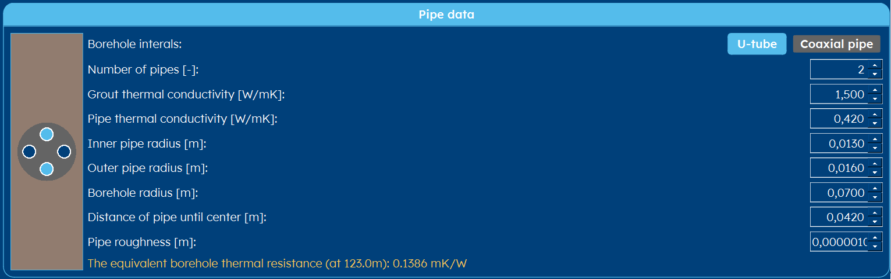

Thermal resistances
-------------------
This section contains some background information about the calculation method within EED.
This is irrelevant for GHEtool, so this paragraph can be ignored.

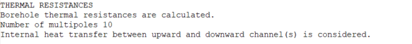

Heat carrier fluid
------------------
The following section contains the fluid properties. Therefore, you need to open once again the :ref:`tab thermal resistance` tab.

.. image:: Figures/EED_HCF.png
  :alt: Heat carrier fluid data within the EED export file

First you need to select *custom* in the *fluid properties* option.

.. note::
    Note that most likely the values in the EED export correspond to a specific glycol %, which is not exported. It can
    be of interest to ask for this explicitly, since EED uses most often negative temperature as a references for the fluid properties.
    As discussed here: :ref:`fluid parameters`, this value has a big influence on the final result. If you simply
    want to compare EED with GHEtool, you can leave this note for what it is.

* **Thermal conductivity** can be directly set within GHEtool.
* **Specific heat capacity** can be directly set within GHEtool.
* **Density** can be directly set within GHEtool.
* **Viscosity** can be directly set within GHEtool ([kg/(m s)] is the same unit as [Pa s].
* **Freezing point** this is not needed in GHEtool.
* **Flow rate per borehole** in GHEtool, a mass flow rate is used, so you need to convert the flow rate in l/s to a flow rate
  in kg/s. Therefore you multiply the *flow rate* from EED with the density and divide that by 1000.

You get the following result:

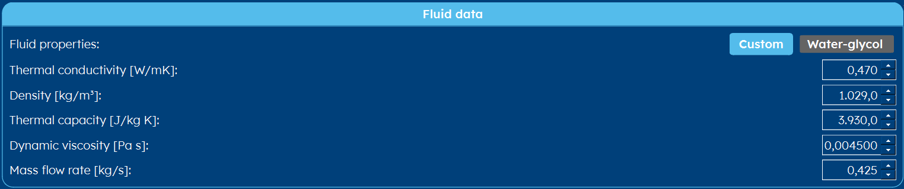

Load
----
As the last step, you need to input the load values from EED into GHEtool. Therefore you open the :ref:`tab thermal demand` tab.

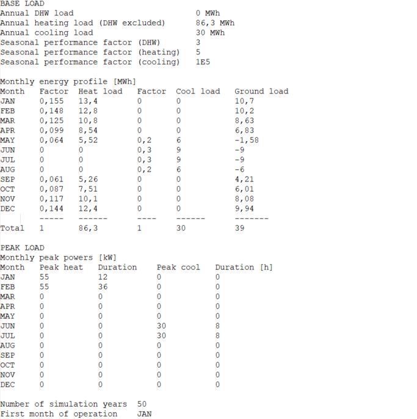

.. caution::
    Please set the *Load type* to *Building* when you use inputs from EED.

* **Annual DHW load** can be set if you select to include domestic hot water.
* **Annual heating load (DHW excluded)** not needed in GHEtool.
* **Annual cooling load** not needed in GHEtool.
* **Seasonal performance factor (DHW)** can be set as *SCOP DHW* in GHEtool.
* **Seasonal performance factor (heating)** can be set as *SCOP* in GHEtool.
* **Seasonal performance factor (cooling)** can be set as *SEER* in GHEtool.

.. note::
    Note that the SEER in GHEtool is limited to 1000, since there is always a primary pump working to circulate the fluid
    across the borefield which is consuming electricity.

For the heating and cooling loads, you need to use the *Heat load* and *Cool load* data from the first table.
.. caution::
    Note that you need to multiply these values by 1000 since they are given in MWh in EED and you need to input kWh in GHEtool.

For the heating and cooling peaks, you use the values in the second table in the *Peak heat* and *Peak cool* column.

You get this result in GHEtool:

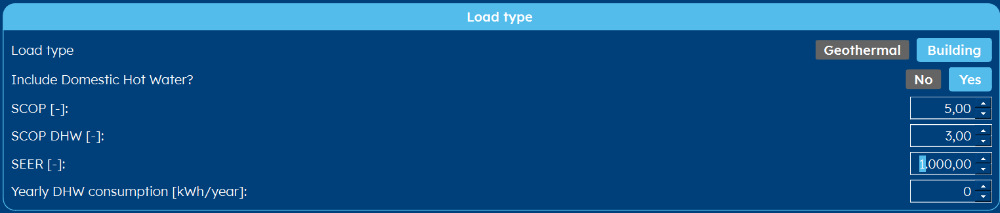

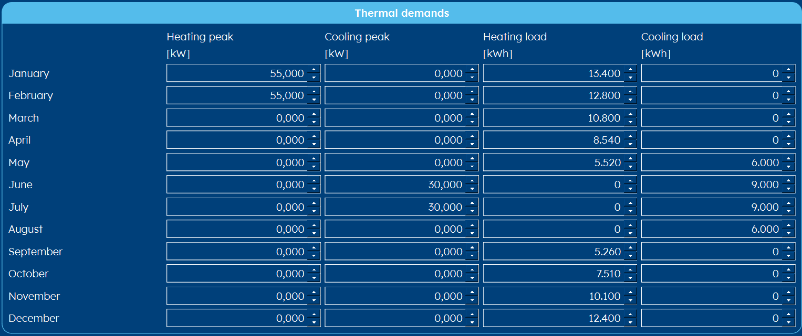

Next, we need to set the peak durations. Therefore, we go to the :ref:`tab earth` tab.
Here you can set a single peak duration for both heating and cooling instead of a value per month.
Simply enter the longest duration of EED for both heating and cooling in GHEtool and your good to go.

.. note::
    GHEtool uses a model that works with a single peak duration for all months. By using just a single peak duration for
    all months, the final feasibility of the geothermal system will not change, since the most critical month will stay the same.
    In order to speed up the calculation, GHEtool therefore only uses one peak duration in heating and cooling.

The *simulation period* can also be set in this tab.
The result looks like this:

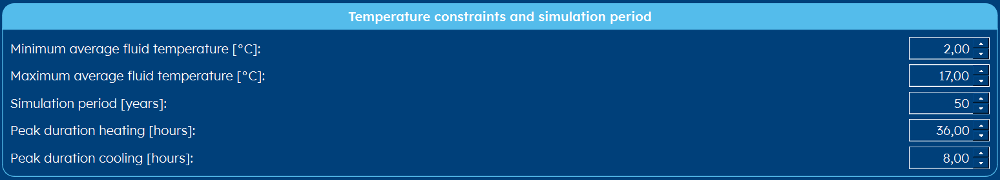

.. note::
    Note that GHEtool always start calculating in the first month of the year. If you have another month than January,
    for now, you need to change the order of the months yourself.

.. admonition:: Congratulations

    Congratulations, you have now successfully entered the EED project in GHEtool!
    When you press calculate, you can see that the results are almost the same with differences that can be explained
    by the use of different models within EED/GHEtool. The converted document can be downloaded :download:`here <Figures/GHEtool_example.GHEtool>`.
