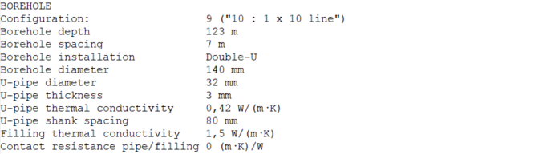

.. _eed data::

How to convert EED data to GHEtool?
###################################
Earth Energy Designer (or EED in short) is the first and most used geothermal sizing software in Europe, so it can happen
that your competitor or client is working with this software instead. Although the features of EED differ (quite a lot)
from those one finds within GHEtool (see also `are FAQ <https://ghetool.eu/faq/>`_), it is possible to convert an EED
project to a GHEtool project. The only thing you need to ask for is the EED data export file like for example :download:`this one <Figures/EED_example.txt>`.
In this article we will go over the different conversion steps if you want to work on an EED project within GHEtool.

.. note::
    Currently, a method to load EED data directly into GHEtool is in development. For the time being however,
    some manual input is required.

Input values
=============
To input the values from the EED export file into GHEtool, it is best to read the document from top to bottom, so
you don't miss any information. The different sections that appear in the EED export file are mentioned in order below.

Ground
------

.. image:: Figures/EED_ground.png
  :alt: Ground data within the EED export file

Borehole
--------

Thermal resistances
-------------------

.. image:: Figures/EED_thermal_resistance.png
  :alt: Thermal resistance data within the EED export file

Heat carrier fluid
------------------

.. image:: Figures/EED_HCF.png
  :alt: Heat carrier fluid data within the EED export file

Load
----

.. image:: Figures/EED_load.png
  :alt: Load data within the EED export file
