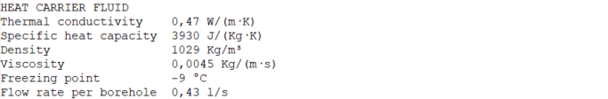

.. _eed data::

How to convert EED data to GHEtool?
###################################
Earth Energy Designer (or EED in short) is the first and most used geothermal sizing software in Europe, so it can happen
that your competitor or client is working with this software instead. Although the features of EED differ (quite a lot)
from those one finds within GHEtool (see also `are FAQ <https://ghetool.eu/faq/>`_), it is possible to convert an EED
project to a GHEtool project. The only thing you need to ask for is the EED data export file like for example :download:`this one <Figures/EED_example.txt>`.
In this article we will go over the different conversion steps if you want to work on an EED project within GHEtool.

.. note::
    Currently, a method to load EED data directly into GHEtool is in development. For the time being however,
    some manual input is required.

Input values
=============
To input the values from the EED export file into GHEtool, it is best to read the document from top to bottom, so
you don't miss any information. The different sections that appear in the EED export file are mentioned in order below.

.. caution::
    Please select the 'Determine temperature profile' aim in the :ref:`tab aim` tab.

Ground
------
The first data you come across in the export, is the ground data. This can be entered within GHEtool in the :ref:`tab earth` tab.

* **Ground thermal conductivity** can be directly set in GHEtool.
* **Ground heat capacity** can be directly set in GHEtool.
* **Ground surface temperature** if you select *custom* you can set the surface temperature.
* **Geothermal heat flux** if you select *flux*, you can set the geothermal heat flux.

The result within GHEtool looks like this:

.. image:: Figures/GHEtool_ground.png
  :alt: Ground data set in GHEtool

Borehole
--------
The next section you see, is related to the borehole internals and configuration. First we will input the borefield data
in the :ref:`tab borefield` tab.

.. image:: Figures/EED_borehole.png
  :alt: Borehole data within the EED export file

* **Configuration** tells you something about the borefield configuration. In this case, we have a borefield with 1 borehole in the width
  direction and 10 in the length direction. You can set this directly in GHEtool.
* **Borehole depth** you can set this directly in GHEtool.

.. note::
    If you don't see the borehole depth, please select 'Determine temperature profile' in the :ref:`tab aim` tab.

* **Borehole spacing** you can set this directly in GHEtool

.. caution::
    EED works with a limited number of possible borefields, with **equal spacing** in both length and width direction.
    The borehole spacing you find in the EED export should therefore always be used for both spacings within GHEtool.

* **Borehole diameter** In GHEtool you need to set the borehole radius, so you need to divide this diameter by 2.

If you do so, you get the result below:

.. image:: Figures/GHEtool_borefield.png
  :alt: Borefield data set in GHEtool

.. note::
    As you can see, EED does not have a parameter for the *buried depth*. This can lead to some (minor) variation
    in the result, since the buried depth is used to estimate the heat losses to the earths surface.

Next, you need to open the :ref:`tab thermal resistance` tab.
If you don't see the possibility to enter the borehole internals there, you need to set the borehole thermal resistance to *dynamic*
in the :ref:`tab options` tab like explained here: :ref:`borehole internals`.

* **Borehole installation** can be directly set in GHEtool using the toggle button *Borehole internals* and the *Number of pipes [-]* input.
* **U-pipe diameter** GHEtool requires a pipe radius, so you need to divides this value by 2 to get the *outer pipe radius*.
* **U-pipe thickness** GHEtool works with inner and outer radii, so you can get the *inner pipe radius* by substracting the pipe thickness from the outer pipe radius.
* **U-pipe thermal conductivity** can directly be set in GHEtool.
* **U-pipe shank spacing** GHEtool works with a pipe distance from the center. This is simple half of the shank spacing.
* **Filling thermal conductivity** can be set in GHEtool as the *grout thermal conductivity*
* **Contact resistance pipe/filling** This is not an input parameter in the GHEtool pipe model.

This gives you the following result:

Thermal resistances
-------------------
This section contains some background information about the calculation method within EED.
This is irrelevant for GHEtool, so this paragraph can be ignored.

Heat carrier fluid
------------------

Load
----

.. image:: Figures/EED_load.png
  :alt: Load data within the EED export file

.. tip::
    Congratulations, you have now successfully entered the EED project in GHEtool!
    When you press calculate, you can see that the results are almost the same with differences that can be explained
    by the use of different models within EED/GHEtool.
