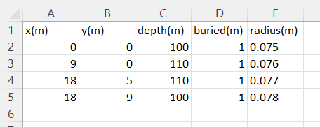
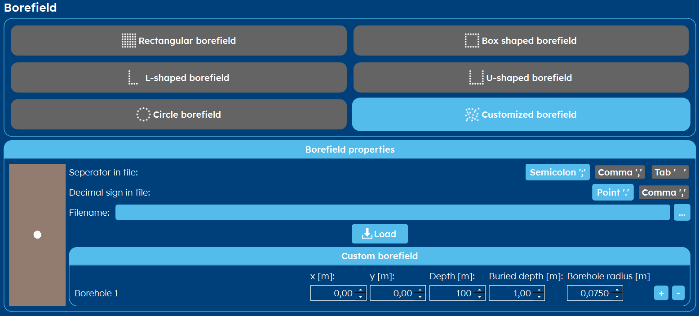
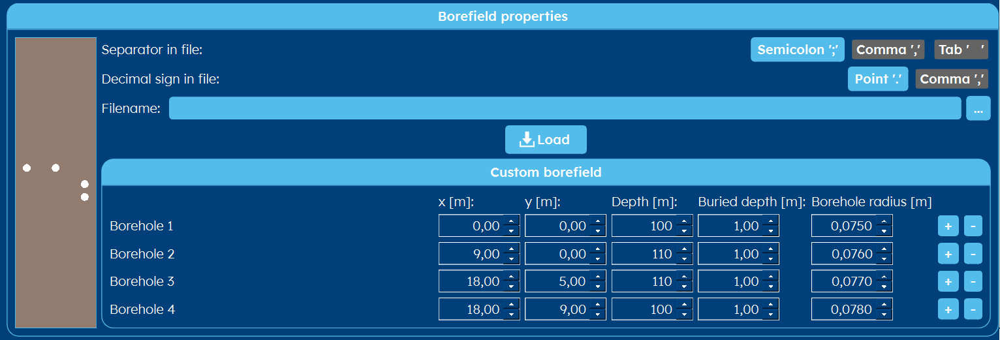

.. _create custom borefield:

How can I Importing a custom borefield
######################################
In this tutorial you will learn how you can create a custom borefield in Excel and import it into GHEtool.

Create custom borefield in Excel
================================

First you need to open Excel and start a new project.
Next, you have to set the columns to: *x(m), y(m), depth(m), buried(m), radius(m)*. Although the exact column names are not
that important, it is easy for you to work with.

.. image:: Figures/excel_with_colums.png
  :alt: Excel file with columns
  :width: 350
  :align: center

Next, you enter the data for all the different boreholes like in the figure below.

.. note::
    Note that we are using here a point '.' as the decimal sign.

Now, you are going to save this document as a csv-file. This can be done by going to:
File > save as, select as a file format 'CSV UTF-8' and press save. Now you have created your own custom borefield in excel.

Import custom borefield into GHEtool
====================================
Next, we are going to import this data into GHEtool. To do so, go to the tab :ref:`tab borefield` and click on *Custom borefield*.

There, click on the three dots next to *Filename* and go to the location where you saved the csv-file previously and open it.
Select as a separator ';' and as a decimal sign '.' and press *load*.

.. tip::
    If you are uncertain what the separator and the decimal sign is, try opening your csv file first in notepad.
    There, it is easier to see what both separator and decimal sign are.

The custom borefield should now be loaded into GHEtool, ready to work with!

.. note::
    Please note that in your case, the location of your csv-file will be visible in the Filename-box.
    Here it is removed for privacy reasons.
